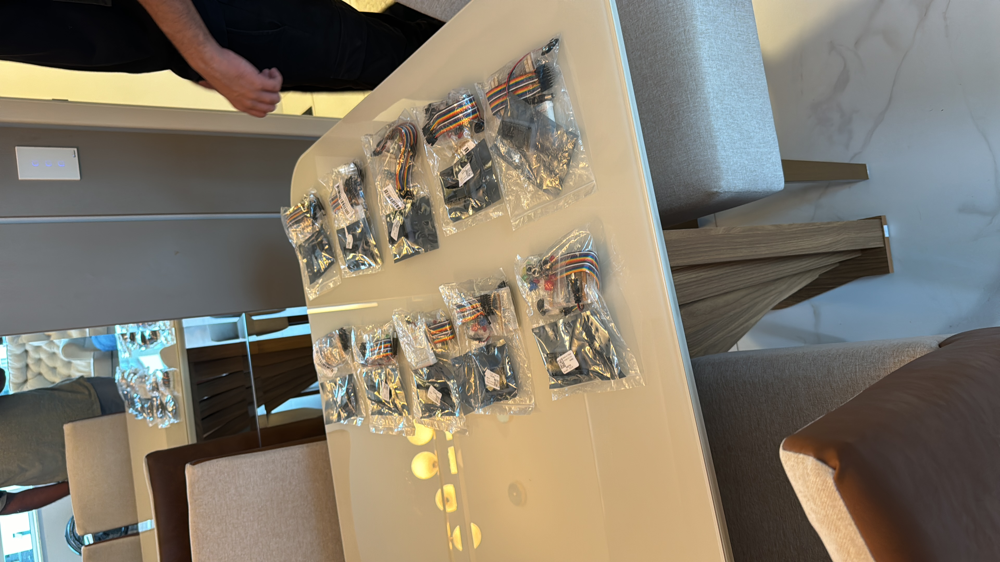

# Curso Presencial “IoT na Prática”: Aprenda e Leve um Kit para Casa!

Garanta sua vaga no nosso curso presencial “IoT na Prática” por R$150 e receba um kit completo com ESP32, protoboard, sensores e componentes eletrônicos. O curso ocorrerá em um sábado, das 9h às 17h, em data ainda a ser definida. Temos apenas 10 kits, então aja rápido!

Durante o curso, vamos mergulhar na prática de IoT, finalizando com um projeto onde você irá coletar e publicar dados em tempo real na AWS, visualizando-os em uma página web. E tem mais: na pausa para o almoço, vamos oferecer uma deliciosa feijoada!

---

## Códigos do Curso IoT na Prática

Este repositório contém todos os códigos desenvolvidos durante o curso "IoT na Prática". Aqui, você encontrará exemplos práticos e projetos que foram abordados ao longo do curso, permitindo uma revisão detalhada das técnicas e tecnologias discutidas. Os códigos estão organizados por sessão e por tópicos, facilitando a navegação e o aprendizado contínuo.

## Sessão de Fotos do Evento

Nesta seção, você pode encontrar fotos dos momentos marcantes do curso. As imagens capturam interações entre os participantes, demonstrações práticas e todas as atividades envolventes que ocorreram durante o evento. Confira abaixo algumas das fotos que rolaram durante o curso:

## Kit do Curso

Aqui está uma foto do kit que cada participante levou para casa após o curso. Este kit inclui todos os componentes necessários para a prática de IoT em casa, permitindo que os alunos continuem a explorar e desenvolver seus projetos com base no que aprenderam.

No kit que vc leva para casa:

⁠1. ESP32: 1 unidade  
2.⁠ ⁠Sensor de temperatura e umidade DHT11: 1 unidade  
3.⁠ ⁠Protoboard 400 furos: 1 unidade  
4.⁠ ⁠LEDs de 3 cores diferentes: 5 unidades (cores aleatórias)  
5.⁠ ⁠Resistor 220 ohm: 10 unidades  
6.⁠ ⁠Resistor 1K ohm: 10 unidades  
7.⁠ ⁠Resistor 10K ohm: 10 unidades  
8.⁠ ⁠Resistor 100K ohm: 10 unidades  
9.⁠ ⁠Fotoresistor 5516: 2 unidades  
10.⁠ ⁠Botões com tampas coloridas: 6 unidades (cores misturadas)  
11. Conector de bateria 9V: 1 unidade  
12. Jumpers macho para macho de 20 cm: 20 unidades (20Pins)  

---

Essa foi a primeira edição, fala comigo para a gente combinar a próxima turma!